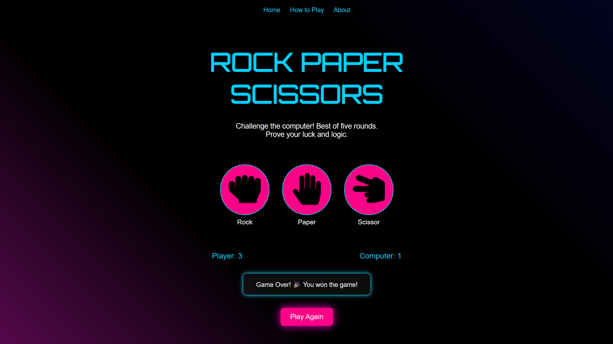

# 🎮 Rock Paper Scissors Game

A web-based interactive **Rock Paper Scissors** game where you challenge the computer in a best-of-five showdown! Designed with a modern UI, playful icons, and responsive layout.



---
## 🌐 Live Demo

> 🔗 [Play Now](https://singharyan006.github.io/Rock_Paper_Scissors/) – Challenge the computer right in your browser!

---

## 🚀 Features

- ✊ Rock, 🖐️ Paper, ✌️ Scissors – Play with intuitive hand icons
- 🤖 Smart computer opponent with random move generation
- 🧠 Best-of-five rounds with score tracking
- 💻 Fully responsive UI with neon-inspired design
- 🔁 Replayable with a single click
- 🧾 "How to Play" and "About" modals for quick guidance

---

## 🕹️ How to Play

1. Click on icons of **Rock**, **Paper**, or **Scissor**
2. Watch your move battle against the computer's
3. Best of 5 rounds wins the game
4. Click **Play Again** to restart anytime

---

## 📁 Project Structure
```
Rock_Paper_Scissors/
├── index.html # Main HTML layout
├── style.css # All custom styles
├── script.js # Game logic & interactions
├── sources/ # SVG icons & preview image
└── README.md # You're reading it!
```
---

## 📚 Tech Stack

- **HTML5**
- **CSS3**
- **JavaScript (ES6)**
- **SVG Assets**

---

## 🤝 Contributions

Pull requests are welcome! If you’d like to:
- Add new features (themes, animations, leaderboard)
- Fix bugs or suggest improvements
- Refactor code or add documentation

Feel free to fork and open a PR.

---

## 🧠 Author

Made with ❤️ by [Aryan Singh](https://github.com/singharyan006/)

---

## 📄 License

This project is open-source and available under the [MIT License](LICENSE).

